# 🛠️ AI-Powered Machine Failure Predictor


---

## 🎯 Overview

This project implements a **Random Forest Classification** model to predict machine failures based on sensor readings in real-time. The system helps manufacturing facilities prevent unexpected downtime by identifying potential failures before they occur, enabling proactive maintenance strategies.

---

## ⚡ Quick Start
**Predict machine failure in seconds:**
1. `git clone https://github.com/your-username/machine-failure-predictor.git`
2. `pip install -r requirements.txt`
3. `streamlit run app.py`

---

# 🔄 Data Pipeline

The following diagram illustrates the end-to-end flow from raw data to prediction:

```mermaid
flowchart LR
    A[📄 Raw Sensor Data] -->|Cleaning & Scaling| B(🧹 Preprocessing)
    B --> C{🤖 Model Training}
    C -->|Random Forest| D[💾 Serialized Model .pkl]
    D --> E[🚀 Streamlit App]
    
    subgraph User Interaction
    E -->|Input: Temp, Speed, Torque| F[⚡ Real-time Prediction]
    end
    
    style A fill:#f96,stroke:#333,stroke-width:2px
    style E fill:#69f,stroke:#333,stroke-width:2px
    style F fill:#9f6,stroke:#333,stroke-width:2px

```



---

## ✨ Features

- **Predictive Analytics**: Forecast machine failures based on 5 key sensor parameters
- **Interactive Dashboard**: User-friendly Streamlit web application for real-time predictions
- **Data Visualization**: Power BI dashboard for exploring machine downtime patterns
- **Model Interpretability**: Feature importance analysis and performance metrics
- **Scalable Architecture**: Easily deployable on cloud platforms

## 📊 Dataset

The project uses the **AI4I 2020 Predictive Maintenance Dataset** from the UCI Machine Learning Repository.

**Dataset Characteristics:**
- **Total Samples**: 10,000 data points
- **Features**: 14 attributes including sensor readings and failure modes
- **Target Variable**: Machine failure (binary classification)
- **Class Distribution**: Imbalanced dataset (handled with RandomOverSampler)

### Input Features

| Feature | Description | Range |
|---------|-------------|-------|
| Air temperature [K] | Ambient air temperature | 290-310 K |
| Process temperature [K] | Process temperature | 300-320 K |
| Rotational speed [rpm] | Tool rotational speed | 500-3000 rpm |
| Torque [Nm] | Torque applied | 0-100 Nm |
| Tool wear [min] | Tool wear time | 0-300 min |

## 🏆 Model Performance

### Random Forest Classifier Results

| Metric | Score |
| --- | --- |
| **Accuracy** | 98.1% |
| **Precision** | 98.0% |
| **Recall** | 98.1% |
| **F1-Score** | 98.1% |

### Model Comparison

| Model | Accuracy | Precision | Recall | F1-Score |
|-------|----------|-----------|--------|----------|
| Logistic Regression | 82.65% | 96.56% | 82.65% | 87.98% |
| Decision Tree | 97.55% | 97.43% | 97.55% | 97.49% |
| **Random Forest** | **98.10%** | **97.99%** | **98.10%** | **98.03%** |

The Random Forest model was selected for deployment due to its superior performance across all metrics.

## 📁 Repository Structure

```
machine-failure-prediction/
│
├── app/
│   └── app.py                          
│
├── data/
│   ├── raw/
│   │   └── ai4i2020.csv               
│   └── processed/
│       └── cleaned_ai3i2020.csv       
│
├── models/
│   ├── random_forest_model.pkl       
│   └── scaler.pkl                     
│
├── notebooks/
│   └── code.ipynb                    
│
├── visualizations/
│   ├── Machine_Downtime.pbix       
│   └── screenshots/                  
│
├── presentation/
│   └── Machine_Failure_Prediction_Presentation.pptx
│
├── assets/
│   └── screenshots/
│
├── requirements.txt                   # Python dependencies
├── .gitignore                        # Git ignore file
├── README.md                         # Project documentation
└── LICENSE                           # MIT License
```

## 👥 Team

* Bassant Yasser
* Tasnim Adel
* Ziad El-Bahy
* Ahmed Mohamed

## 🚀 Installation

### Prerequisites

- Python 3.8 or higher
- pip package manager
- (Optional) Virtual environment

### Setup Instructions

1. **Clone the repository**
```bash
git clone https://github.com/yourusername/machine-failure-prediction.git
cd machine-failure-prediction
```

2. **Create a virtual environment** (recommended)
```bash
python -m venv venv
source venv/bin/activate  # On Windows: venv\Scripts\activate
```

3. **Install dependencies**
```bash
pip install -r requirements.txt
```

## 💻 Usage

### Running the Web Application

1. Navigate to the app directory:
```bash
cd app
```

2. Run the Streamlit application:
```bash
streamlit run app.py
```

3. Open your browser and go to `http://localhost:8501`

4. Enter sensor values:
   - Air temperature (K)
   - Process temperature (K)
   - Rotational speed (rpm)
   - Torque (Nm)
   - Tool wear (min)

5. Click **"Predict Failure"** to get real-time predictions

### Using the Jupyter Notebook

1. Launch Jupyter:
```bash
jupyter notebook
```

2. Open `notebooks/code.ipynb` to explore:
   - Exploratory Data Analysis (EDA)
   - Data preprocessing pipeline
   - Model training and evaluation
   - Feature importance analysis

## 🔧 Model Training

The training pipeline includes:

1. **Data Preprocessing**
   - Handling missing values
   - Feature selection (removing UDI, Product ID, Type columns)
   - MinMax scaling for numerical features

2. **Handling Class Imbalance**
   - RandomOverSampler to balance the dataset

3. **Model Training**
   - Random Forest with 100 estimators
   - 80-20 train-test split
   - Stratified sampling

4. **Model Evaluation**
   - Classification report
   - Confusion matrix
   - Cross-validation

To retrain the model:

```python
from sklearn.ensemble import RandomForestClassifier
from sklearn.preprocessing import MinMaxScaler
from imblearn.over_sampling import RandomOverSampler
import joblib

# Load and preprocess data
# ... (see notebook for full code)

# Train model
model = RandomForestClassifier(n_estimators=100, random_state=0)
model.fit(X_train, y_train)

# Save model
joblib.dump(model, 'models/random_forest_model.pkl')
joblib.dump(scaler, 'models/scaler.pkl')
```

## 🌐 Deployment

### Local Deployment

The application is ready for local deployment using Streamlit (see [Usage](#usage) section).

### Cloud Deployment Options

#### Streamlit Cloud
1. Push your repository to GitHub
2. Connect to [Streamlit Cloud](https://streamlit.io/cloud)
3. Deploy directly from your repository

#### Docker
1. Create a `Dockerfile`:
```dockerfile
FROM python:3.9-slim
WORKDIR /app
COPY requirements.txt .
RUN pip install -r requirements.txt
COPY . .
EXPOSE 8501
CMD ["streamlit", "run", "app/app.py"]
```

2. Build and run:
```bash
docker build -t machine-failure-predictor .
docker run -p 8501:8501 machine-failure-predictor
```

## 🛠️ Technologies Used

### Machine Learning & Data Science
- **scikit-learn** - Model training and evaluation
- **pandas** - Data manipulation
- **numpy** - Numerical computing
- **imbalanced-learn** - Handling class imbalance
- **joblib** - Model serialization

### Visualization
- **matplotlib** - Static visualizations
- **seaborn** - Statistical visualizations
- **Power BI** - Interactive dashboards

### Web Application
- **Streamlit** - Web framework for ML applications

### Development Tools
- **Jupyter Notebook** - Interactive development
- **Python 3.8+** - Programming language

## 📈 Results

### Classification Report (Test Set)

```
              precision    recall  f1-score   support

         0.0       0.99      0.99      0.99      1932
         1.0       0.76      0.65      0.70        68

    accuracy                           0.98      2000
   macro avg       0.87      0.82      0.84      2000
weighted avg       0.98      0.98      0.98      2000
```

### Key Insights

- The model successfully identifies 98% of all cases
- High precision for normal operation (99%)
- Moderate recall for failure cases (65%) - room for improvement
- Excellent overall performance for industrial application

## 🤝 Contributing

Contributions are welcome! Please feel free to submit a Pull Request.

1. Fork the repository
2. Create your feature branch (`git checkout -b feature/AmazingFeature`)
3. Commit your changes (`git commit -m 'Add some AmazingFeature'`)
4. Push to the branch (`git push origin feature/AmazingFeature`)
5. Open a Pull Request

## 📄 License

This project is licensed under the MIT License - see the [LICENSE](LICENSE) file for details.

## 🙏 Acknowledgments

- UCI Machine Learning Repository for the AI4I 2020 Dataset
- Scikit-learn community for excellent documentation
- Streamlit for the amazing web framework

---

⭐ If you found this project helpful, please consider giving it a star!

**Made with ❤️ for Predictive Maintenance**
   
